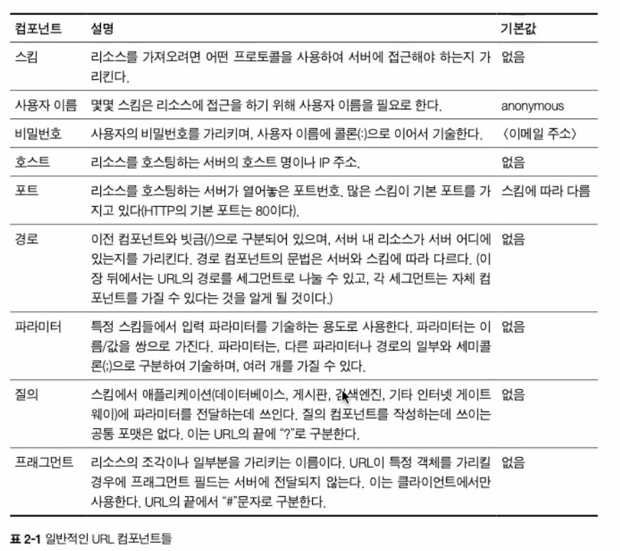
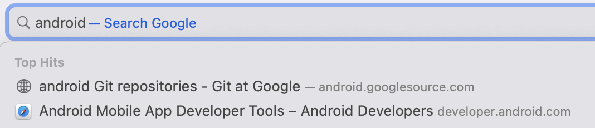

# 02. URL과 리소스

> 🙃 **들어가기 전 리소스에 대한 정의!**  
> 리소스는 텍스트, 이미지, 동영상 등 웹에서 나타내는 모든 자원을 의미함

## (1) URL
- 인터넷의 리소스를 가리키는 주소

## (2) 문법
`<scheme>://<user name>:<password>@<host>:<port>/<path>?<query>#<fragemnt>`

- 정리  


### 스킴(scheme)
- 사용할 프로토콜의 정보를 나타냄 (= 주어진 리소스를 어떻게 접근할거냐에 대한 정보)
- `:` 문자로 구분
- 대소문자 구분 X

> 😧 스킴(scheme)이랑 스키마(schema)랑 비슷하지만 다른 개념이니 참고!! [[참고 링크](https://rareone.tistory.com/91)]

### 호스트(host)와 포트(port)
```
https://github.com/sseung416
https://161.58.228.45:80/index.html
```
- 요청하려는 리소스에 접근할 수 있는 서버의 위치
  - 그니까 해당 리소스를 제공하는 장치의 위치 정보임
- 도메인 이름이나 IP 주소로 직접 나타냄
- HTTP 기본 포트는 80

### 사용자 이름과 비밀번호
- 필요한 경우 사용자 이름과 비밀번호를 요구함
  - ex) FTP..

### 경로(path)
```
http://github.com/sseung416/page/URL과%20Resource.md
```
- 서버 내 리소스의 위치 정보
- `/` 문자를 기준으로 경로조각으로 나뉨
  - 각 경로조각은 파라미터 컴포넌트를 가질 수 있음

### 파라미터(parameter)
```
http://github.com/sseung416/page;type=network/URL과%20Resource.md;graphics=true;
```
- 해당 리소스에 접근하기 위해 필요한 정보를 받는 부분
  - ex) 파라미터가 없다면.. 바이너리 이미지 파일이 필요해도 서버에서 무지성 텍스트 파일만 뿌려주기 때문에 망함!
- `;` 문자를 통해 구분
- 여러 개의 파라미터를 가질 수 있음

### 질의 문자열(query string)
```
http://github.com/sseung416/page?item=1493&color=black
```
- 요청할 리소스의 범위를 좁히기 위해 사용하는 부분
- `?` 문자 우측의 값
- `이름=값` 형태로, 각 값은 `&` 문자로 나뉨

### 프래그먼트(fragment)
```
http://github.com/sseung416/page/URL과%20Resource.md#fragments
```
- 리소스의 특정 부분을 가리키는 정보
  - 해당 리소스보다 더 작은 정보로 나누어 데이터를 지정할 수 있음
- ex) 특정 부분으로 스크롤
- HTTP 객체는 전체 범위를 다루기 때문에 프래그먼트 값은 서버로 전달하지 않음
- 서버에서 전체 리소스를 받은 후, 브라우저에서 프래그먼트 값을 사용해 리소스의 일부분을 보여줌


## (3) 단축 URL
URL은 상대 URL과 절대 URL로 나뉨

### 상대 URL
- URL을 짧게 표기하는 방식
  - ex) `./etc.html` 
- 리소스에 접근하는데 필요한 정보를 얻기 위해서는 base URL을 사용해서 구함
  - ex) base URL: `http://abcdef.com/simple.html`, simple.html 내부에 정의된
    ```html
    <!-- simple.html -->
    ...
    <a href="./etc.html">link to etc</a>
    ```

[//]: # (    .....아 귀찮아 todo: 예시 들기)
[//]: # ( todo: 상대 경로 변환 과정 정리하기)


### URL 확장
- URL을 빠르게 입력할 수 있도록 돕는 기능

#### 호스트명 확장
- 단순 호스트명만 입력해도 전체 호스트명으로 확장시켜주는 기능

| .png) | .png) |
|-------------------------------------------|-------------------------------------------|
| 호스트명만 입력해주어도..                            | 전체 호스트명으로 자동 확장되어 로드된다!                   |

### 히스토리 확장
- 방문했던 URL의 기록을 저장해, 입력 값과 매칭되는 URL의 값을 미리 보여주는 기능  
  


## (4) 안전하지 않은 문자
URL은 안전한 전송을 제공함  
여기서 안전한 전송은 정보가 유실될 위험없이 리소스를 요청하는 것을 의미함  
안전한 전송을 위해 문자열을 인코딩하거나 예약어를 통해 문자 사용을 제한하도록 함

### 인코딩 체계
- 안전하지 않은 문자를 표현하기 위한 방식
- 안전하지 않은 문자를 이스케이프 문자로 변경함
  - 이스케이프 문자: `%` 기호와 ASCII 코드로 표현되는 2개의 16진수로 표현한 문자


## (5) 스킴의 바다
요약하면 자주 쓰이는 스킴의 종류를 보여주는 페이지임

### http
- 하이퍼텍스트 전송 프로토콜(Hypertext Transfer Protocol)
- 사용자 이름이나 비밀번호는 없지만, 기본적인 규격은 URL과 동일
- 형식: `http://<host>:<port>/<path>?<query>#<fragment>`
- default port: 80

### https
- http + SSL(Secure Sockets Layer)
- 암호화를 위해 HTTP 커넥션의 양 끝단에서 보안 소켓 계층(SSL)를 사용한 HTTP
- 형식은 HTTP와 동일
- default port: 443

### mailto
- 이메일 주소를 가리킬 때 사용
- 형식: `mailto:<RFC-822-addr-spec>`

### ftp
- 파일 전송 프로토콜(File Transfer Protocol)
- FTP 서버의 파일을 읽고 씀
- 형식: `ftp://<user name>:<password>@<host>:<port>/<path>;<parameter>`

### rtsp, rtspu
- 실시간 스트리밍 프로토콜(Real Time Streaming Protocol) 

### file
- 호스트 기기(로컬 디스크, 네트워크 파일 시스템 등)에서 접근 가능한 파일을 나타내는 프로토콜
  - Android에서 내부 저장소의 파일의 url를 출력해보면 `file://`로 시작하는 것을 볼 수 있음!!
- 호스트가 생략되어 있으면, URL를 사용하고 있는 기기의 로컬 호스트가 기본 값이 됨
- 형식: `file://<host>/<path>`

### news
- 특정 문서나 뉴스 그룹을 접근할 때 사용하는 프로토콜

### telnet
- 대화형 서비스에 접근할 때 사용하는 프로토콜
- 인터넷이나 로컬 네트워크 영역에 접근하고자 할 때 사용

## (6) 미래 - URN
- URN(Uniform Resource Names): 이름을 기반으로 리소스의 위치를 가리키는 방식
- 리소스의 위치를 옮기더라도, URN 값이 변함이 없다는 장점이 있음
- 하지만 URL에서 URN으로 주소 체계를 바뀌는 것은 매우 힘드므로 아직까지 채택되지는 않음
