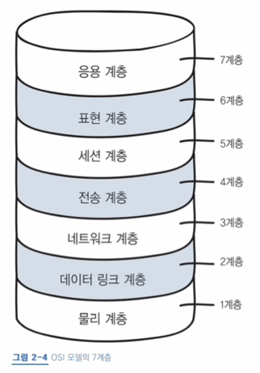
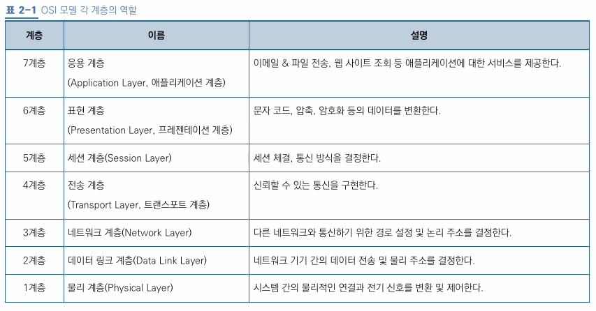
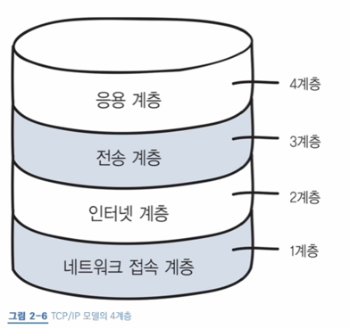
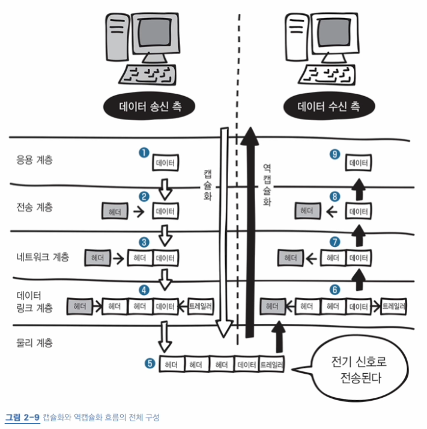

# 2장 네트워크 기본 규칙

## 06 네트워크 규칙

- 프로토콜: 네트워크 통신 규약
  - 컴퓨터 간 데이터를 주고 받기 위해서 반드시 필

## 07 OSI 모델과 TCP/IP 모델

- OSI 모델: ISO가 정의한 국제 통신 표준 규격약, 네트워크 통신의 기본 
  - ISO(International Organization for Standardization)라는 국제표준화기구에서 지정
  - 표준 규격이 없으면 제조사마다 통신 규격이 다 달라져, 제조사가 다른 컴퓨터 간의 통신이 불가능함

- 데이터 송신 측은 하위 계층 -> 상위 계층으로, 데이터 수신 측은 하위 계층 -> 상위 계층으로 데이터를 전달함
  - 각 계층은 독립적으로, 전달되는 동안 다른 계층에 영향을 받지 않음
- TCP/IP: OSI 7계층을 4개의 계층으로 단순화시켜 사용하는 모델, 인터넷 모델이라고도 불림
  - 물리 + 데이터 링크 -> 네트워크 접속 계층
  - 네트워크 -> 인터넷 계층
  - 전송 -> 전송 계층
  - 세션 + 표현, 응용 -> 응용 계층

## 08 캡슐화와 역캡슐화

- 헤더: 전송하는 데 필요한 정보, 데이터 앞 부분에 위치
- 캡슐화: 송신 측에서 데이터에 헤더를 붙여나가는 과정
  - OSI 모델의 각 과정(전송, 네트워크, 데이터 링크, 물리)을 지날 때마다 헤더가 붙음
  - 데이터 링크 계층에서는 헤더와 트레일러가 추가됨
- 역캡슐화: 수신 측에서 데이터의 헤더를 제거해나가는 과정

[//]: # (> VPN &#40;Virtual Private Network&#41;)
[//]: # (> - 가상 사설망, 가상 통신 터널을 통해 거점 간 연결을 하여 통신하거나 외부의 인터넷으로 사내에 접속하는 것)
[//]: # (> - 인터넷 VPN: .... 나중에 내용 추가하기 ㅎㅎ)
