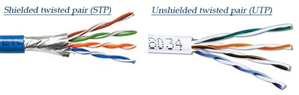
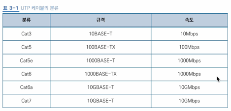
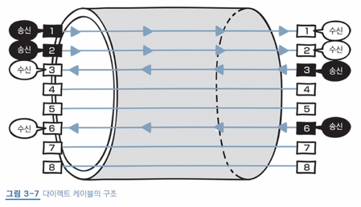
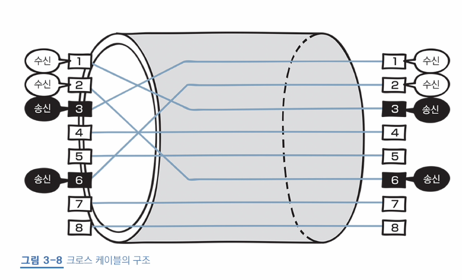

# 3장 물리 계층 : 데이터를 전기 신호로 변환하기

## 09 물리 계층의 역할과 랜 카드의 구조

- 물리 계층
  - OSI 최하위 계충
  - 네트워크 장치와 컴퓨터를 연결
  - 전기 신호 변환 및 제어를 담당
- 전기 신호: 전압의 변화가 모여 만들어진 신호
  - 네트워크를 통해 데이터를 전송하기 위해서는 데이터를 전기신호로 변환해야 함
  - 아날로그 신호: 전화 회선, 라디오 등에서 사용
  - 디지털 신호: 0과 1의 비트열로만 이뤄짐
  - 송신측에서 0과 1의 비트열 데이터를 전기 신호로 변환해 전송하고 수신측에서 전기 신호를 다시 비트열 데이터로 복원함
- 랜 카드(LAN card): 데이터를 전기신호로 변환하는 장치, 네트워크 카드, 네트워크 인터페이스 컨트롤러(NIC)라고도 불림

## 10 케이블의 종류와 구조

### 유선 전송 매체: 트위스트 페어 케이블

- 전송 매체: 데이터가 흐르는 물리적 선로, 유선과 무선으로 나뉨
  - 유선: *트위스트 페어 케이블*, 광케이블 등
  - 무선: 적외선, 마이크로파, 라디오파 등
- 트위스트 페어 케이블(twist pair cables): 가장 많이 사용되는 전송 매체, *랜 케이블*(LAN cable, 랜 선)이라고 불림
  - 랜 케이블 양 쪽에는 *RJ-45*라고 불리는 커넥터가 붙어 있음

<image src="picture/RJ-45.png" width="200"></image>

  - 실드(shield): 금속 호일이나 금속 매듭, 외부의 노이즈를 차단함 -> 비쌈
  - UTP(Unshielded Twist Pair): 바치폐 연선, 구리선 8개를 2개씩 꼬아 만든 4쌍의 전선, 실드로 보호되어 있지 않은 케이블
  - STP(Shielded Twist Pair): 차폐 연선, 2개씩 꼬아 만든 선을 실드로 보호한 케이블

  - UTP 케이블은 전송 품질에 따라 아래와 같이 구분됨

### 랜 케이블의 종류: 다이렉트 케이블과 크로스 케이블

|             다이렉트 케이블             |             크로스 케이블             |
|:--------------------------------:|:-------------------------------:|
|  |  |

- 다이렉트 케이블: 구리선 8개를 같은 순서로 연결한 케이블
  - 컴퓨터와 스위치를 연결할 때 사용
  
- 크로스 케이블: 구리선 8개 중 1번, 2번 선을 각각 3번과 6번에 연결한 케이블
  - 일부러 송수신 선을 교차하여 데이터가 충돌하지 않도록 함
  - 컴퓨터 간 직접 연결할 때 사용
- 두 케이블 모두 1번, 2번, 3번, 6번 선만 사용하고 나머지 4개의 선은 사용하지 않음 ([+ 왜 4개만 사용해요?](https://dpg.danawa.com/bbs/view?boardSeq=34&listSeq=2168540&past=Y))

## 11 리피터와 허브의 구조

### 리피터

- 리피터(repeater): 전기 신호를 정형(일그러진 전기 신호를 복원)하고 증폭하는 네트워크 중계 장치
  - 일대일 통신만 가능
  - 허브, 스위치 등에서 리피터 기능을 지원하기 때문에 요즘은 안 씀

### 허브

- 허브(hub): 포트를 여러 개 가져, 여러 컴퓨터의 통신을 지원하는 장치, 리피터 허브, 더미 허브라고도 불림
  - 전기 신호를 정형, 증폭하는 기능을 함 => 리피터 허브(repeater hub)
  - 데이터의 목적지를 구분하지 못하고 모든 포트에 데이터를 날림 => 더미 허브(dummy hub)
    - 이 문제를 해결하기 위해 스위치(switch)가 나타남

[//]: # (> auto MDIX)