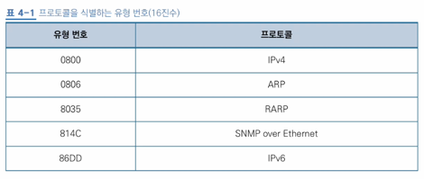
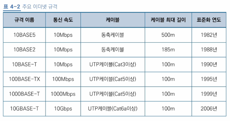

# 4장 데이터 링크 계층 : 랜에서 데이터 전송하기

## 12 데이터 링크 계층의 역할과 이더넷

- 데이터 링크 계층: 네트워크 장비 간 신호를 주고받는 규칙을 정하는 계층
  - 랜에서 데이터를 주고 받기 위해 필요
  - 캡슐화될 때, 이더넷 헤더와 트레일러가 붙음 
- 이더넷(Ethernet): 데이터 링크 계층에서 데이터를 주고 받는 규칙 중 가장 많이 사용되는 규칙
  - 여러 대가 동시에 데이터를 전송해도 충돌하지 않는 구조로 설계됨
  - 충돌(collision): 여러 대가 동시에 데이터를 보내어 데이터가 부딪히는 현상
  - CSMA/CD: 이더넷에서 데이터 전송 시점을 늦추는 방법, 반송파 감지 다중 접속 및 충돌 탐지의 약자
    - CS: 송신하려는 컴퓨터의 케이블에 신호가 흐르는지 확인하는 규칙
    - MA: 케이블에 데이터가 흐르지 않는다면 데이터를 보내도 좋다는 신호
    - CD: 충돌이 발생하고 있는지 확인하는 규칙
  - 근데 성능 안 좋아서 요즘은 스위치를 씀

## 13 MAC 주소와 구조

- MAC 주소: 물리 주소(제조할 때 새겨져서), 전 세계에서 유일한 번호
  - **48비트**로 구성: 앞 24비트는 랜 카드 **제조사 번호**, 뒤 24비트는 제조사가 붙인 랜 카드 **일련번호**
- 이더넷 헤더: 데이터 링크 계층에서 붙이는 헤더
  - 목적지 MAC 주소(6바이트), 출발지 MAC 주소(6바이트), 유형(2바이트)
  - 유형: 이더넷으로 전송되는 상위 계층의 프로토콜 종류, 대충 프로토콜 종류를 식별하는 번호가 삽임됨
  
- 트레일러: FCS(Frame Check Sequence)라고 불림, 데이터 전송 중의 오류 발생 여부 확인
- 프레임: 이더넷 헤더와 트레일러가 추가된 데이터

## 14 스위치의 구조

- 스위치: 데이터 링크 계층에서 동작, 레이어 2 스위치/스위칭 허브라 불림, 허브와 다르게 데이터가 충돌하지 않음
- MAC 주소 테이블: 스위치의 포트 번호와 해당 포트에 연결된 컴퓨터의 MAC 주소가 등록된 데이터베이스
  - MAC 주소 학습 기능: 프레임 데이터가 전달될 때, 테이블에 MAC 주소가 등록되어 있지 않다면 자동으로 MAC주소와 포트를 등록해주는 기능
  - 플리딩(홍수): MAC 주소가 테이블에 등록되지 않았을 때, 수신 포트를 제외한 모든 포트로 프레임을 전송하는 것
  - MAC 주소 필터링: MAC 주소를 기준으로 목적지(포트)를 선택하는 것

## 15 데이터가 케이블에 충돌하지 않는 구조

### 전이중 통신과 반이중 통신

- 전이중 통신: 송수신을 동시에 통신
  - 컴퓨터와 컴퓨터 간 통신
  - 컴퓨터와 스위치 간 통신
- 반이중 통신: 회선 하나로 송수신을 번갈아가며 통신
  - 동시에 전송 시 충돌 발생
  - 컴퓨터와 허브 간 통신

### 충돌 도메인

- 충돌 도메인: 충돌이 발생했을 때, 그 영향이 미치는 범위
  - 허브는 연결된 모든 포트가 충돌 도메인, 스위치는 충돌난 포트 하나만 충돌 도메인
- ARP(Address Resolution Protocol): 목적지 컴퓨터의 IP 주소를 통해 MAC 주소를 찾기 위한 프로토콜
  - ARP 요청(request): 목적지 컴퓨터의 MAC 주소를 모를 때, 네트워크에 브로드캐스트를 날리는 것
  - ARP 응답(reply): 해당 IP 주소를 갖고 있는 컴퓨터가 MAC 주소를 응답으로 보내는 것, 해당 IP 주소가 아니면 응답하지 않음
  - ARP 테이블: MAC 주소와 IP 주소의 매핑 정보, 처음 이후의 요청은 이 테이블을 참조함
    - IP가 변경되면 MAC 주소도 변경되기 때문에 보존 기간을 **ARP 캐시**로 지정하고 **일정 시간이 지나면 삭제**함

## 16 이더넷의 종류와 특징

- 이더넷은 통신 속도와 케이블 종류에 따라 규격이 나뉨

  - 10BASE-T -> 10: 통신 속도(Mbps), BASE(BAND): 전송 방식, T: 케이블 종류
    - BASEBAND: 펄스 신호로 인한 디지털 전송 방삭
  - UTP 케이블은 뒤에 `-`을 붙이고, 동축 케이블은 붙이지 않음
  - 동축 케이블 뒤 숫자는 케이블의 최대 길이를 의미, 100m 단위로 표시
    - 10BASE5의 최대 길이는 500m~