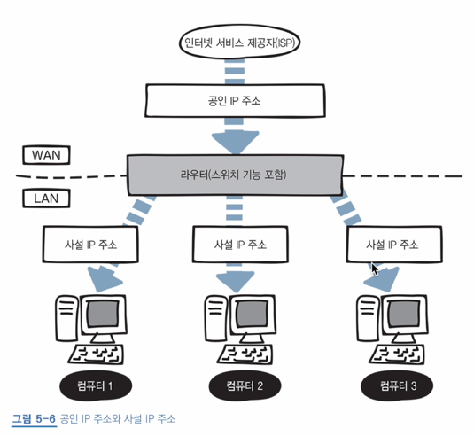

# 5장 네트워크 계층 : 목적지에 데이터 전달하기

## 17 네트워크 계층의 역할

- 네트워크 계층: 네트워크 간 통신을 가능하도록 지원하는 역할
  - 캡슐화 시, **IP 헤더**가 붙음  

  - IP 패킷: IP 헤더가 붙은 데이터 
- 라우터: 네트워크 계층에서 사용하는 장비로, 목적지가 정해졌을 때, 목적지까지의 최적의 경로를 지정해주는 장치
  - 네트워크의 분리를 위함
  - 라우팅(routing): 목적지 IP 주소까지 어떤 경로로 데이터를 보낼 지 결정하는 것
  - **레이어 3 스위치**라는 장비로도 라우팅이 가능함
    - 레이어 3 스위치: 네트워크를 분할해 라우팅을 할 수 있는 네트워크 장비
  - 라우팅 테이블: 경로 정보를 등록하고 관리하는 테이블, 라우터 내부에 위치
- IP 주소: 어떤 네트워크의 어떤 컴퓨터인지를 구분하는 주소
    - MAC 주소는 하나의 네트워크 내부에서 사용하는 개념이라면, IP 주소는 여러 네트워크 사이에서 사용되는 개념
- IP(Internet Protocol): 네트워크 계층에서 사용하는 대표적인 프로토콜

## 18 IP 주소의 구조

- 인터넷 서비스 제공자(ISP)를 통해 할당받을 수 있음
- **2진수**, **32비트**로 구성: MAC 주소는 48비트 16진수로 표시, IP 주소는 32비트 (사람이 보기 쉽도록) 10진수로 표시
  - 읽기 쉽도록 8비트 단위(옥텟)으로 나누어 표시  
  
- IP의 버전은 IPv4와 IPv6로 나뉨
  - IPv4로 생성한 주소로도 부족하여 IPv6가 생겨남
  - **IPv4**: **32비트**, 43억 개의 주소
  - **IPv6**: **128비트**, 340간 개의 주소 (사실상 무제한)
- 공인 IP 주소: 인터넷에 직접 연결되는 컴퓨터나 라우터에게 할당되는 IP 주소, 인터넷 서비스 제공자가 제공 
- 사설 IP 주소: 회사나 가정의 랜에 연결되는 컴퓨터에 할당되는 IP 주소
  - 네트워크 관리자가 직접 사설 IP를 할당하거나 라우터의 DHCP 기능을 통해 자동 할당함 
  - DHCP(Dynamic Host Configuration Protocol): IP 주소를 자동으로 할당하는 프로토콜  
  

- IP 주소 = 네트워크 ID + 호스트 ID
  - 네트워크 ID: 어떤 네트워크인지 나타내는 주소
  - 호스트 ID: 해당 네트워크의 어떤 컴퓨터인지 나타내는 주소

## 19 IP 주소의 클래스 구조

### IP 주소 클래스

- 네트워크 ID와 호스트 ID를 늘리거나 줄여서 **네트워크 크기를 조정**할 수 있음, 네트워크 크기별로 **클래스**가 구분됨
- IP 주소는 A-E 클래스로 나뉘며, 일반적으로 A-C 클래스를 사용  

  - A 클래스: 8비트 네트워크 ID, 24비트 호스트 ID
  - B 클래스: 16비트 네트워크 ID, 16비트 호스트 ID
  - C 클래스: 24비트 네트워크 ID, 8비트 호스트 ID
- 각각 공인 IP 주소와 사설 IP 주소의 범위  

[//]: # (### IP 주소의 전체 범위 계산하기)
[//]: # (todo: 정리하시oh p.191)

## 20 네트워크 주소와 브로드캐스트 주소의 구조

- 네트워크 주소, 브로드캐스트 주소는 자신의 IP 주소로 설정할 수 없
- 네트워크 주소: 전체 네트워크에서 작은 네트워크를 식별할 때 사용, 전체 네트워크를 대표하는 주소
  - 호스트 ID가 (10진수) 0인 주소값임
    - ex) 192.168.1.1 ~ 192.168.1.6은 **192.168.1.0**의 네트워크에 있다
- 브로드캐스트 주소: 네트워크에 있는 컴퓨터나 장비에게 한 번에 데이터를 전송할 때 사용되는 전용 IP 주소
  - 호스트 ID가 (10진수) 255인 주소값임
    - ex) **192.168.1.255**로 데이터를 전송하면 192.168.1.0의 네트워크 안 모두에게 데이터가 송신된다!

## 21 서브넷의 구조

### 서브넷

- 서브넷: 서브넷팅을 통해 분할한 네트워크
  - 서브넷팅: 대규모 네트워크를 작은 네트워크로 분할하는 것
  - 서브넷을 통해 브로드캐스트로 전송되는 패킷의 범위를 좁힐 수 있음
  - 서브넷팅되면 네트워크 ID + 서브넷 ID + 호스트 ID로 바뀜  
  

### 서브넷 마스크

- 서브넷 마스크: 네트워크 ID와 호스트 ID를 식별하기 위한 값
  - 대충 네트워크 ID를 255로 바꾼 값이라고 생각하면 쉬움 
  - A 클래스의 서브넷 마스크: 255.0.0.0
  - B 클래스의 서브넷 마스크: 255.255.0.0
  - C 클래스의 서브넷 마스크: 255.255.255.0
- 프리픽스(prefix) 표기법: 서브넷 마스크를 슬래시(/비트수)로 나타낸 것
  - ex) `255.255.255.0` -> `/24`(8비트+8비트+8비트)로 나타낼 수 있음
  - 위 예제를 서브넷팅하면? `/28`로 나타냄, 프리픽스 표기법으로 나타낼 때는 네트워크 ID + 서브넷 ID까지의 비트 수를 합쳐서 표현하면 되는 듯함  
  
  

## 22 라우터의 구조

### 라우터

- 라우터: 네트워크 분리 위한 장치
  - 스위치(또는 허브)만을 사용해 연결하면 해당 스위치에 연결된 모든 컴퓨터가 하나의 네트워크에 포함됨
  - 기본 게이트웨이: 다른 네트워크에 데이터를 전달하기 위해 라우터의 IP 주소를 설정하는 것
    - 라우터에서 네트워크의 출입구를 지정해줌
    - 기본 게이트웨이는 자동으로 설정됨

### 라우팅

- 라우팅 테이블에서 경로를 설정하는 방법
  - 수동 설정: 소규모 네트워크에 적합
  - 자동 설정: 대규모 네트워크에 적함
- 라우팅 프로토콜: 라우터 간 라우팅 정보를 교환하기 위한 프로토콜, 정보를 받아 라우팅 테이블에 자동으로 경로를 저장함
  - RIP, OSPF, BGP 등
