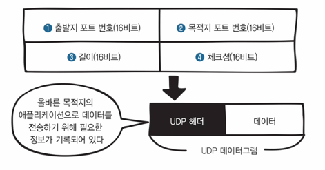

# 6장 전송 계층 : 신뢰할 수 있는 데이터 전송하기

## 23 전송 계층의 역할

### 전송 계층의 2가지 역할

- 전송 계층: 목적지에 신뢰할 수 있는 데이터를 전송함
  - 오류 점검 기능이 있어, 오류 발생 시 다시 데이터 요청
  - 전송된 데이터의 목적지가 어느 애플리케이션인지 식별하는 기능도 포함
  
### 연결형 통신과 비연결형 통신

- 전송 계층의 특성은 **정확성/신뢰성**(데이터를 문제 없이 전달했는가?)과 **효율성**(데이터를 빠르게 전달했는가?)으로 나뉨
- **연결형 통신**: **쇤뢰, 정황**한 데이터를 주고 받는 형식
  - 대표적인 프로토콜: **TCP**
- **비연결형 통신**: **효율적**으로 데이터를 주고 받는 형식
  - 라디오, 라이브 동영상 등
  - 대표적인 프로토콜: **UDP**


## 24 TCP의 구조

### TCP

- 세그먼트: TCP 헤더가 붙은 데이터
- TCP 헤더: 전송 계층에서 캡슐화 시 붙는 헤더

  - 데이터를 전송하려면 연결(가상의 독점 통신로를 확보하는 작업)이 필요함 -> TCP 헤더의 코드 비트!  
  - 코드 비트: TCP 헤더의 107번째 비트~112번째 비트, 6비트의 연결 제어 정보(URG, ACK, PSH, RST, SYN, FIN)를 나타냄
    - 초기 값은 0, 비트가 활성(사용)되면 1이 됨
    - 데이터 연결 시 사용되는 비트: SYN(연결 요청), ACK(확인 응답)

### 3-ways handshake

- 3-way 핸드셰이크: 데이터를 보내기 전 연결 확립을 위해 패킷 요청을 3번 교환하는 것
  - 연결이 확립될 때는 **SYN**과 **ACK**를 사용
  - 연결이 끊길 때는 **SYN**과 **FIN**(연결 종료)를 사용 
- 연결이 확립될 때 과정
    ```
  1. 컴퓨터1에서 컴퓨터2로 연결 확립 요청(SYN)을 보냄
  2. 컴퓨터2에서 컴퓨터 1에게 허가한다는 연결 확립 응답(ACK)과 데이터 전송 허가를 위한 연결 확립 요청(SYN)을 보냄
  3. 컴퓨터1은 컴퓨터2에게 허가한다는 연결 확립 응답(ACK)를 보냄
    ```
- 연결이 끊길 때 과정
    ```
  1. 컴퓨터1에서 컴퓨터2로 연결 종료 요청(FIN)을 보냄
  2. 컴퓨터2에서 컴퓨터1로 연결 종료 응답(ACK)을 보냄
  3. 또, 컴퓨터2에서 컴퓨터1로 연결 종료 요청을 보냄(FIN)
  4. 컴퓨터1에서 컴퓨터2로 연결 종료 응답(ACK)을 보냄
    ```


## 25 일련번호와 확인 응답 번호의 구조

### 일련번호와 확인 응답 번호

- 실제 데이터를 보내거나 받을 때는 TCP 헤더의 일련번호(32비트)와 확인 응답 번호(32비트)를 사용함
- 일련번호(sequence number): 수신자가 몇 번째 데이터를 받았는지의 정보
- 확인 응답 번호(acknowledgement number): 송신자가 몇 번째 데이터를 수신했는지의 정보
  - 다음 데이터를 요청하는 데 사용함
  - 확인 응답: 다음 데이터를 송신측에 요청하는 것  

- 재전송 제어: 데이터가 유실된 경우, 일련 번호와 확인 응답 번호를 사용해 데이터를 재전송하는 것
- 근데 위와 같은 방식은 세그먼트 하나를 보낼 때마다 확인 응답을 반환해야 하므로 비효율적

### 윈도우 크기

- TCP 헤더의 윈도우 크기는 버퍼의 크기를 저장함
- 버퍼: 받은 세그먼트를 일시적으로 보관하는 장소
  - 일시적으로 보관 후 한 번에 확인 응답을 보내기 때문에 효율적
  - 오버플로: 대량의 데이터가 전송되어 버퍼에 보관하지 못하고 넘친 것
- 윈도우 크기: 버퍼의 한계 크기, 얼마나 많은 용량의 데이터를 저장해 둘 수 있는지를 나타냄
  - 3-way 핸드셰이크를 할 때 판단함  
  
  - 이 윈도우 크기를 활용해 확인 응답을 지연시킬 수 있음
    - 컴퓨터 1에서 컴퓨터 2의 윈도우 크기를 넘기기 직전까지 세그먼트를 송신하고 확인 응답을 전달함 


## 26 포트 번호의 구조

- TCP 헤더의 출발지 포트 번호와 목적지 포트 번호를 통해 데이터의 목적지 애플리케이션을 구분할 수 있음
- 포트 번호는 각 애플리케이션의 주소라고 생각하면 편함
- 포트 번호는 0~65535번까지 사용 ㄱㄴ, 책에서 설명하는 부분은 잘못된 것 같아서 [다른 블로그](https://itinformation.tistory.com/59) 참조
  - 0~1023번: 잘 알려진 포트(well=known ports)
    - 시스템 관리자나 권한이 높은 사용자(root)만 사용 가능, 시스템 포트라고도 불림
  - 1024~49151번: 등록된 포트(registered ports)
    - 시스템의 모든 사용자가 사용 가능, 사용자 포트라고도 불림
  - 49152~65535번: 동적 포트(dynamic ports)
- [TCP, UDP 포트 목록 모음](https://ko.wikipedia.org/wiki/TCP/UDP의_포트_목록)


## 27 UDP의 구조

### UDP

- 비연결형 통신
- 효율성 중시, 데이터를 빠르고 효율적으로 전달
- 동영상 스트리밍 등에서 사용

### UDP 헤더



- UDP 데이터그램: UDP 헤더가 붙은 데이터
- UDP를 사용하면 브로드캐스트를 보낼 수 있음
  - 브로드캐스트: 랜에 접속한 모든 장비에 데이터를 전송하는 것
  - 불특정 다수에게 전달할 때 좋음
  - TCP는 3-way 핸드셰이크의 과정을 거쳐야하기 때문에 브로드캐스트를 날리기엔 부적합 