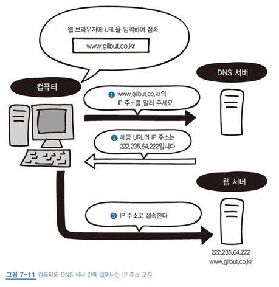
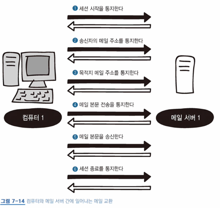
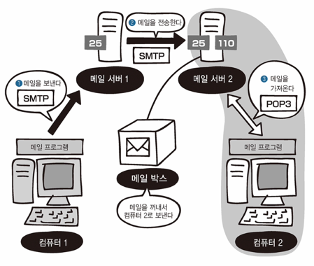

# 7장 응용 계층 : 애플리케익션에 데이터 전송하기

## 28 응용 계층의 역할

- 응용 계층(애플케이션 계층)
  - OSI 최상위 계층
  - 애플리케이션 서비스 제공


## 29 웹 서버의 구조 (웹 사이트 접속)

### WWW

- World Wide Web, 줄여서 W3나 웹이라 불림
- HTML, URL, HTTP 3가지 기술이 사용됨
  - HTML: 태그를 사용하는 마크업 언어, 하이퍼텍스트를 작성하는 마크업 언어
    - 하이퍼링크를 통해 문자나 이미지 표시 가능
  - 웹 사이트를 이동하면 해당 HTML 파일을 웹 서버에 전송하여 사용자에게 화면을 보임
  - HTML 문서와 이미지 파일을 각각 별도로 요청함

### HTTP

- 80번 포트
- 클라이언트에서 데이터를 요청하는 **HTTP 요청**을 보내고 서버에서는 정상적으로 처리됐다는 **HTTP 응답**을 반환하고 `index.html`를 클라이언트에게 보
- HTTP 버전별 간단 특징
  - HTTP/1.0 이전에는 요청을 보낼때마다 연결을 끊고 다시 연결함 -> 성능 별루 ㅠ
  - HTTP/1.1의 keepalive 기능: 연결 수립 후 데이터 교환이 모두 끝났을 때, 연결을 끊는 방식
  - HTTP/2 버전부터는 요청 순서와 관계없이 응답을 반환할 수 있게 됨


## 30 DNS 서버의 구조 (이름 해석)

- DNS: URL을 IP 주소로 변환하는 서비스(시스템)
  - 이름 해석: 도메인 이름에 알맞는 IP 주소를 찾아내는 것 
  - 호스트 이름(서버 이름)과 도메인 이름으로 구성됨: ex) `www.naver.com` -> `www`: 호스트 이름, `naver.com`: 도메인 이름
  - 컴퓨터가 웹 브라우저에 URL를 입력해 접속했을 때의 과정  
  
  - 접속했는데, 해당 DNS 서버에 URL과 부합하는 IP가 없을 때의 과정: 다른 DNS 서버에 질의
    - DNS 서버는 전 세계에 흩어져 있고 모두 계층적으로 연결됨  
  .png)


## 31 매일 서버의 구조 (SMTP와 POP3)

### 메일의 송수신 구조

- SMTP: 메일을 보낼 때 사용되는 프로토콜, 포트 24번
- POP3: 메일을 받을 때 사용되는 프로토콜, 포트 110번
- 메일 송신 과정
  ```
  1. SMTP를 사용해 컴퓨터 1 -> 메일 서버 1로 메일을 보냄
  2. SMTP를 사용해 메일 서버 1 -> 메일 서버 2로 메일을 보냄
  3. POP3를 사용해 메일 서버 2 -> 컴퓨터 2로 메일 데이터를 보냄
  ```
  - 메일 서버를 사용하려면, 그 메일 서비스를 제공하는 메일 서버의 호스트 이름을 설정하면 됨
    - ex) `www.naver.com` -> `asdf@naver.com`, `www.google.com` -> `asdf@google.com`

### SMTP에 의한 메일 송신과 메일 전송


.png)

### POP3에 의한 메일 수신


.png)