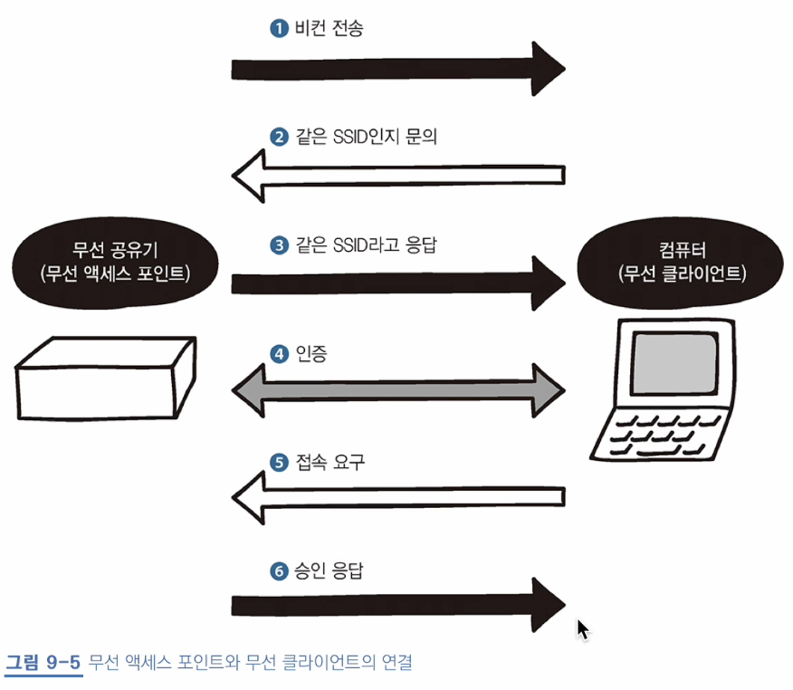

# 9장 무선 랜 이해하기

## 35 무선 랜의 구조

### 무선랜

- **무선 랜**: 케이블 없이 인터넷에 접속하도록 돕는 장치
  - 장점: 케이블이 닿지 않는 곳까지 연결 가능
  - 단점: 비교적 해킹 가능성이 높음, 속도가 불안정하고 전파가 약하면 연결이 잘 안 됨
  - **무선 액세스 포인트**(Wireless Access Point, WAP), **무선 랜 클라이언트**(컴퓨터, 스마트폰 등)로 구성
- 무선 액세스 포인트와 연결하기 위해서는 **무선 랜 칩**이나 **무선 랩 어댑터**가 설치되어야 함
  - 무선 랜 어댑터는 USB 메모리 방식 어댑터, 컴퓨터 카드 방식 어댑터로 나뉨
  - 무선 공유기가 무선 액세스 포인트를 지원함

### 인프라스트럭쳐 방식과 애드훅 방식

- 무선 랜을 연결하는 방식은 인프라스트럭쳐 방식과 애드훅 방식이 있음
- 인프라스트럭쳐(infrastructure): 무선 액세스 포인트를 통해 통신하는 방식
- 애드훅(Add Hoc) 방식: 무선 클라이언트끼리 직접 통신하는 방식
- 주로 인프라스트럭쳐 방식을 더 사용

### 무선 랜 규격

- 무선 랜은 IEEE802.11 규격을 준수
  - IEEE802.11: 미국 기술 표준화 단체인 IEEE에서 정의한 무선 랜 표준화 기술
- 무선 액세스 포인트는 **무선 AP**나 **무선 공유기**로 불림

## 36 SSID의 구조

### SSID

- SSID(Service Set IDentifier): 액세스 포인트의 고유 이름
  - 네트워크 이름, 인증, 암호화, 암호화 키
  - 무선 액세스 포인트와 무선 클러이언트 간 혼선을 막기 위함 (+ 연결을 위함)
- 무선 액세스 포인트와 클라이언트 간 연결 과정  

  - 비컨(beacon): 무선 액세스 포인트가 자신을 알리는 신호
    - 네트워크 내 모든 기기에게 주기적으로 신호를 전송함
    - 무선 클라이언트는 이 신호를 통해 연결함
  - 클라이언트와 무선 액세스 포인트의 SSID가 동일하다면 인증 절차를 거치고 연결을 요청하게 됨

### 채널

- 채널: 주파수 대역을 분할한 것, 무선 랜은 여러 기기가 동시에 연결할 수 있도록 주파수 대역을 분할함
  - 무선 엑세스 포인트와 클라이언트 간 통신하고자 한다면 동일한 채널에 있어야 함
  - 무선 액세스 포인트는 알아서 최적의 채널을 자동 설정함
- 전파 간섭: 전파가 겹치는 무선 공유기끼리 같은 채널로 설정되어 있어, 주파수가 겹치는 현상
  - 통신 속도가 저하 -> 따라서 겹치지 않도록 무선 공유기를 각각 멀리 설치해야 한다~
  - 또, 서로 다른 채널을 사용하더라도 주파수가 일부분 겹칠 수 있으므로 전파 간섭이 발생할 수 있음
