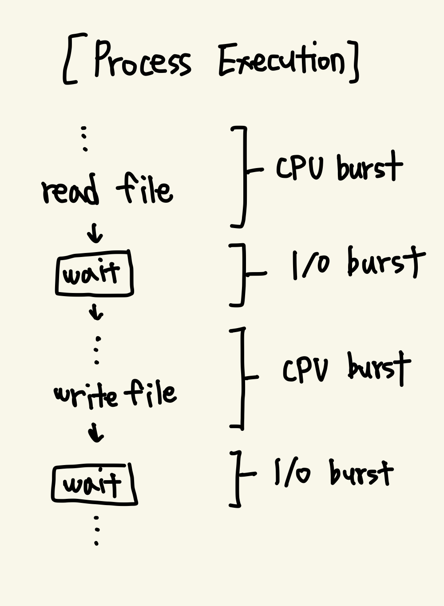
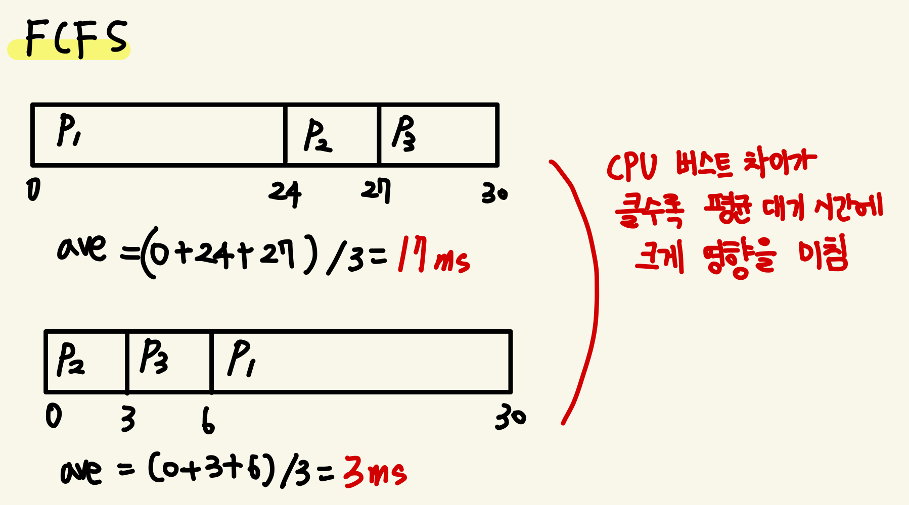
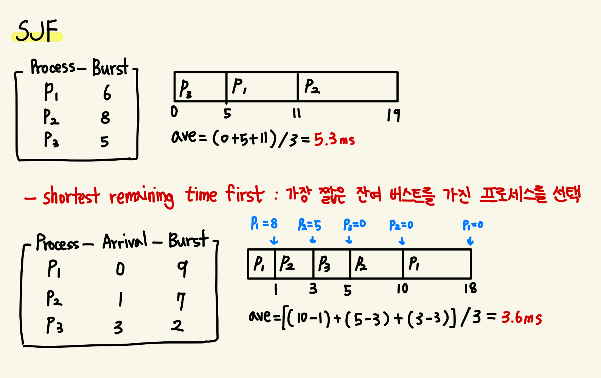
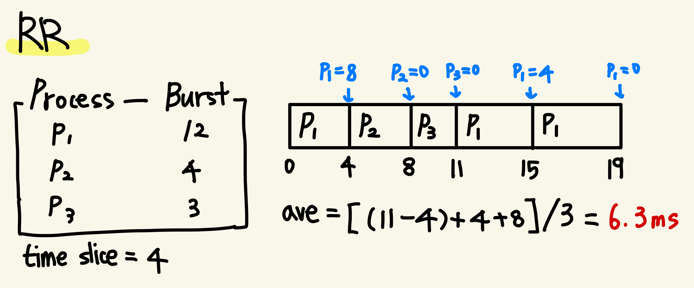

# 5. CPU 스케줄링

## (1) 기본 개념
### 스케줄링
- 운영체제의 기본적인 기능
- 어떤 프로세스가 대기해야 할 경우, 운영체제가 CPU를 해당 프로세스로부터 회수해 다른 프로세스에 할당하는 작업
- 프로세스는 I/O 요청이 오면, 해당 요청이 완료될 때까지 무한 대기함 -> CPU가 계속 놀기 때문에 시간 낭비! 고로 스케줄링이 필요

### CPU-I/O 버스트 사이클



- 프로세스의 실행은 CPU 버스트와 I/O 버스트의 사이클로 구성됨
- 마지막 CPU 버스트가 끝나면 실행이 종료됨
- 실행하려는 작업이 무엇이 중점이냐에 따라 CPU 버스트와 I/O 버스트의 시간은 달라짐
  - ex) 데이터베이스 조회는 I/O 중점(즉, 짧은 CPU 버스트로 이뤄짐), 계산기는 CPU 중점(반대로 긴 CPU 버스트가 많다)
  - CPU 버스트의 시간에 따라 CPU 스케줄링 알고리즘을 선택하는 기준이 될 수 있으니 유의하기

### CPU 스케줄러
- 준비 큐에서 실행할 프로세스를 선택하는 장치
  - 여기서 선택하는 기준이 스케줄링이다 ~
- 준비 큐는 선입선출의 큐가 아닐 수도 있음

### 선점 및 비선점 스케줄링
- CPU 스케줄링은 다음 4가지 상황에서 발생함
  ```
  (1) 프로세스가 실행 -> 대기 상태로 전환될 때 (I/O request, wait() 등)
  (2) 프로세스가 실행 -> 준비 완료 상태로 전환될 때 (인터럽트)
  (3) 프로세스가 대기 -> 준비 완료 상태로 전환될 때 (I/O completion)
  (4) 프로세스가 종료됨
  ```
- 비선점형(nonpreemptive)/협조적(cooperative) 스케줄링
  - 1, 4번 해당 -> 반드시 준비큐의 다른 프로세스를 실행해야 하는 경우
  - 프로세스가 CPU를 방출할 때까지 계속해서 CPU를 점유하는 방식
  - 비선점형 커널
    - 문맥 교환을 하기전 프로세스가 blocking되도록 기다림
    - 커널 구조 단순
    - 실시간 컴퓨팅에는 지원 불가
- 선점형(preemptive) 스케줄링
  - 2, 3번 해당
  - 언제든지 우선순위가 높은 프로세스가 현재 실행중인 프로세스를 중단하고 CPU를 점유할 수 있는 방식
  - 최신 운영체제에서 채택
  - 데이터가 공유될 때, 경쟁 상태를 발생 가능
  - 선점형 커널
    - 경쟁 상태를 방지하기 위한 동기화 기법이 필요

### 디스패처 (Dispatcher)
- 스케줄링 기능 중 하나, 선택된 프로세스에게 주는 CPU 제어 모듈
  - ㅇㅇ 그 프로세스 디스패처 맞습니다~~
- 디스패처는 아래 작업을 실행함
  ```
  - context switching
  - 사용자 모드 전환
  - 사용자 프로그램을 특정 위치로 이동(jump)하는 작업
  ```
- context switching 시 호출되기 때문에 매우 빠르게 수행되야 함
- 디스패치 지연(dispatch latency): 한 프로세스를 정지하고 다른 프로세스를 시작하는데 소요되는 시간


[//]: # (- 자발적 ...문맥 교환....웅애..)
[//]: # (- 비자발적 문맥 교환)


## (2) 스케줄링 기준
스케줄링 알고리즘을 선택하는 기준은 크게 5가지임 (물론 이외에도 많음)
- CPU 이용률: 40% ~ 90% 범위가 적당
- 처리량: 단위 시간당 완료된 프로세스의 개수
- 총처리 시간: 프로세스의 제출 시간과 완료 시간
- 대기 시간: 준비 큐에서 대기하면서 보낸 시간의 합
- 응답 시간: 한 요구를 제출하고 응답이 나올 때까지의 시간, 대화식 시스템에서의 선택 기준 (평균 응답 시간을 최소화하는 것보다 응답 시간의 편차를 최소화하는 것이 낫다)


## (3) 스케줄링 알고리즘
- **CPU 스케줄링**: 준비 큐에 있는 프로세스 중 어느 프로세스에 CPU 코어를 할당할건지 결정하는 알고리즘
  - 처리 코어가 하나일 때 가정하고 설명하니 참고
- 간트(gantt) 차트: 프로세스의 시작 시간 및 종료 시각을 도식화한 막대 차트 (아래에서 나옴)

### 선입 선처리 스케줄링 (FCFS, first-come-first-saved)



- 준비큐에 삽입된 순서대로 실행하는 알고리즘 
- 선입선출(FIFO) 큐로 관리
- 가장 간단한 알고리즘이자 비선점형 알고리즘
- 평균 대기 시간이 매우 길 수 있음
  - 호위 효과를 발생시킬 수 있기 때문!
- 대화형 시스템에서 사용 불가

> **호위 효과 (convoy effect)**  
> 모든 프로세스가 하나의 긴 프로세스가 CPU를 양도하도록 기다리는 것  
> CPU와 장치 이용률을 낭비함!

### 최단 작업 우선 스케줄링 (SJF, shortest-job-first)



- 작업(CPU 버스트)이 가장 짧은 프로세스를 우선으로 실행하는 알고리즘
- 최소의 평균 시간을 가지기 때문에 가장 최적한 알고리즘!
- 다음 CPU 버스트 길이를 알 방법이 없기 때문에 구현 불가능하지만, 다음 CPU가 이전 버스트의 길이와 비슷할 것이라고 가정하여 예측하는 방식으로는 구현 ㄱㄴ
- 선점형, 비선점형 둘 다 될 수 있음: 준비큐에 처음부터 CPU 버스트가 짧은 순으로 진입하면, 선점이 이뤄질 필요가 없다~

[//]: # (> 다음 버스트 기링 예측하는 그래프 죵리하긔~~ 지수 평균 오쩌구)

### 라운드 로빈 스케줄링 (RR, round-robin)



- 선입 선처리(FCFS) + 선점
- CPU 버스트를 타임 슬라이스/시간 할당량이라고 하는 작은 단위로 나누어서 실행하는 알고리즘
- 한 프로세스에는 **한 번의 타임 슬라이스동안만 CPU를 할당**하고(타이머 설정), 타임 슬라이스가 끝나면 (인터럽트를 통해) 다른 프로세스로 CPU를 넘김
- CPU 버스트가 타임 슬라이스보다 작은 경우, 프로세스에서 자발적으로 방출
- 반대로 타임 슬라이스보다 긴 경우, 타이머가 끝나고 인터럽트를 발생시켜 프로세스를 중지함
- 타임 슬라이스에 따라 성능 차이, 총 처리 시간이 좌우됨
  - 타임 슬라이스가 크다? 그건 걍 FCFS임~, 작다? context switching이 너무 많이 발생해~ => 적당한 시간 설정이 매우 중요
  - 현대는 10~100ms의 범위의 타임 슬라이스를 가짐
  - CPU 버스트의 80%는 타임 슬라이스보다 짧도록 시간을 설정해야 함

### 우선순위 스케줄링 (priority scheduling)
- 우선순위가 높은 프로세스를 먼저 할당하는 알고리즘, 우선순위가 같으면 FCFS 순서로 스케줄링함
- 우선순위의 범위는 운영체제마다 다 다름
  - 0이 더 높은 우선순위인지, 10이 더 높은 우선순위인지.. 운영체제마다 다 다르기 때문에 잘 모른다~
- 선점/비선점 둘 다 가능
- 우선 순위는 내외부적인 요인으로 결정됨
  - 내부적: 시간 제한, 메모리 요구, 열린 차일 수, 평균 I/O 및 CPU 버스트 비율 등
  - 외부적: 프로세스 중요도, 컴퓨터 비용 등...
- 문제점: 무한 봉쇄/기아 상태 
  - 낮은 우선순위의 프로세스가 CPU를 무한정 대기하는 현상
  - 기아 상태의 프로세스는 결국 실행되거나 시스템이 충돌해 프로세스를 잃어버림
  - 해결 방안
    - 노화: 오랫동안 대기하는 프로세스들의 우선순위를 점진적으로 증가시키는 것
    - 라운드 로빈에 우선순위 스케줄링을 결합하는 방식

[//]: # (todo: 라운드 로빈이 어떻게 무한 봉쇄를 막는지 아해가 잘 안 됨...)

### 다단계 큐 스케줄링 

### 다단계 피드백 큐 스케줄

## (4) 스레드 스케줄링

## (5) 다중 처리기 스케줄링

## (6) 실시간 CPU 스케줄링

## (7) 운영체제 사례들

## (8) 알고리즘의 평가